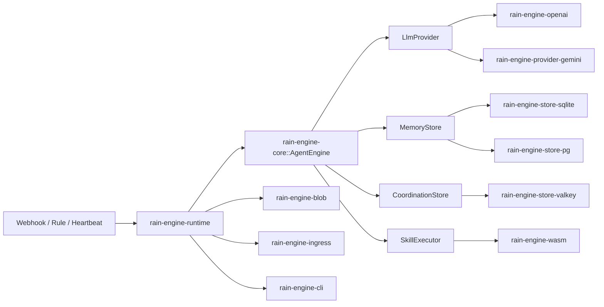

# RainEngine

`RainEngine` is a server-side Rust agent engine for event-driven automation.

It currently ships as a workspace with:

- `rain-engine-core`: engine loop, policy model, provider/store traits, in-memory store
- `rain-engine-blob`: local and in-memory blob backends for multimodal attachments
- `rain-engine-cli`: `agent.yaml` validation, runtime bootstrapping, and local RainPack pulling
- `rain-engine-ingress`: shared ingress envelope plus Valkey Streams consumer utilities
- `rain-engine-openai`: OpenAI-compatible tool-calling provider
- `rain-engine-provider-gemini`: Gemini multimodal and context-caching provider
- `rain-engine-wasm`: WASM-only skill execution with scoped host capabilities
- `rain-engine-store-pg`: production-oriented Postgres persistence
- `rain-engine-store-valkey`: Valkey coordination claims and scratchpad storage
- `rain-engine-store-sqlite`: durable local/dev persistence
- `rain-engine-runtime`: reference HTTP runtime and config/bootstrap wiring
- `rain-engine-macros`: schema-driven skill manifest derive support

## Architecture

## Examples

- Embedded SQLite flow: [rain-engine-runtime/examples/embedded_sqlite.rs](/Users/adrift/projects/rain-engine/rain-engine-runtime/examples/embedded_sqlite.rs)
- Runtime bootstrap config: [rain-engine-runtime/examples/runtime_postgres.rs](/Users/adrift/projects/rain-engine/rain-engine-runtime/examples/runtime_postgres.rs)
- Enterprise customer-support example: [examples/customer_support_agent.rs](/Users/adrift/projects/rain-engine/examples/customer_support_agent.rs)
- Declarative deployment config: [examples/agent.yaml](/Users/adrift/projects/rain-engine/examples/agent.yaml)
