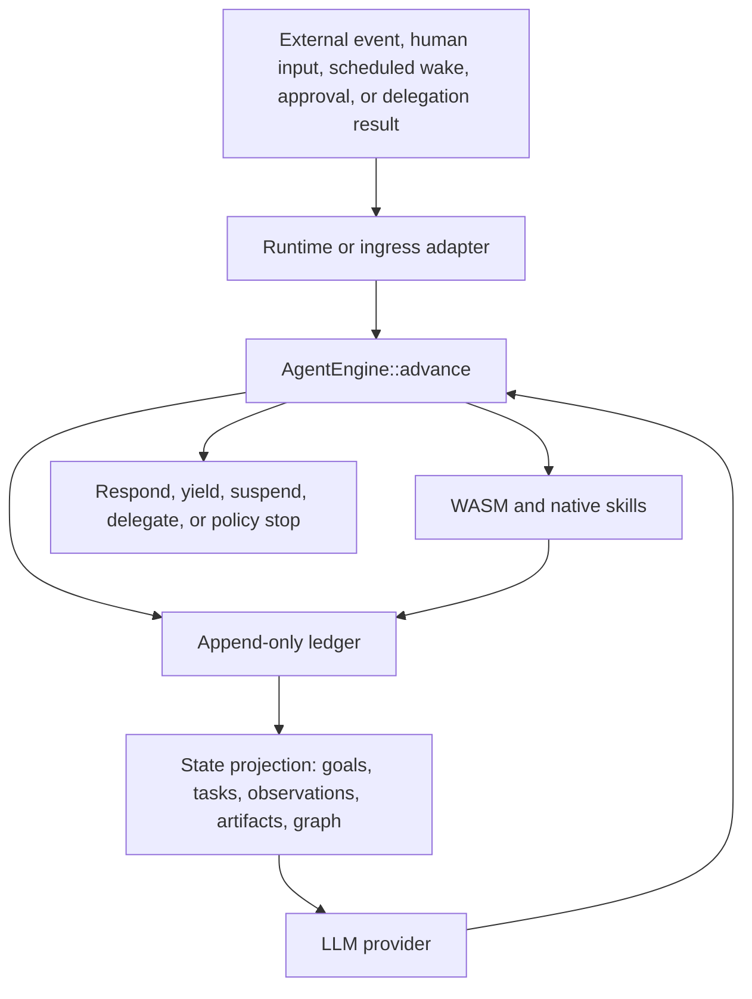

# RainEngine

RainEngine is a self-improving, event-sourced Rust library workspace for
building durable AI agent systems.

The core idea is simple: an agent is a state machine backed by an append-only
ledger. Every webhook, human message, scheduled wake, approval, delegation
result, model decision, tool call, tool result, and terminal outcome is recorded
as a durable event. Runtimes repeatedly call `AgentEngine::advance(...)` to move
the state machine forward one step at a time.

The kernel also reflects on its own ledger. It records what happened, summarizes
tool and provider performance, applies bounded policy overlays for future
advances, and rolls those overlays back if they regress. Self-improvement is
visible, auditable, and never grants new power silently.

## Workspace

- `rain-engine-core`: provider-neutral event kernel, domain models, policies, traits, ledger projections, and in-memory stores
- `rain-engine-cognition`: optional planners, task routing, review policy, wake policy, and reflection policy
- `rain-engine-memory`: ledger-backed exact replay, recent working sets, graph lookup, and simple semantic retrieval
- `rain-engine-runtime`: reference Axum runtime library that parses events and owns the advance loop
- `rain-engine-client`: Rust client for runtime integrations
- `rain-engine-ingress`: shared event envelope and Valkey Streams worker utilities
- `rain-engine-blob`: local and in-memory blob stores for multimodal attachments
- `rain-engine-wasm`: Wasmtime executor for untrusted skills with explicit host capabilities
- `rain-engine-macros`: `#[derive(SkillManifest)]` for typed skill manifests
- `rain-engine-skills`: built-in trusted native skills for local development and runtime-backed deployments
- `rain-engine-channels`: channel adapters that translate external messages into kernel events
- `rain-engine-provider-gemini`: Gemini REST provider with multimodal content, parallel tool calls, and cache metadata
- `rain-engine-openai`: OpenAI-compatible baseline provider
- `rain-engine-store-pg`: Postgres append-only ledger store
- `rain-engine-store-sqlite`: SQLite ledger store for local development and tests
- `rain-engine-store-valkey`: Valkey coordination claims and short-lived scratchpad storage

## Architecture



## Kernel Contract

`AgentEngine::advance(AdvanceRequest)` is the only core execution primitive. It
loads session history, applies one trigger or continuation, persists derived
kernel events, asks the provider at most once, executes at most one planned tool
graph, persists the resulting records, and returns an `AdvanceResult`.

Tool execution is checkpointed. `CallSkills` decisions are materialized as a
`ToolExecutionGraph`; each node records queued, validated, started, and terminal
checkpoints. On continuation after interruption, the kernel replays the ledger
and resumes unfinished nodes instead of repeating completed work. Tool arguments
are validated against each skill manifest before execution, and invalid inputs
become structured tool results.

Deliberation is auditable rather than hidden. Providers may emit `Plan` actions
with concise summaries, candidate actions, and confidence. Those records can be
refined across advance calls, but the ledger remains the source of truth.

Convenience loops belong outside the kernel. The reference runtime exposes
`run_until_terminal(...)`, and ingress workers use the same pattern when
processing stream entries.

## Self-Improvement

RainEngine can run in `AutoWithGuardrails` mode. After terminal outcomes, it
persists reflection records, tool performance summaries, strategy preferences,
and policy tuning records. Safe numeric limits such as `max_steps`,
`provider_timeout_ms`, `max_tool_timeout_ms`, and `max_parallel_skill_calls` can
be adjusted for future advances through `PolicyOverlay` records.

Guardrails are explicit:

- prior ledger records are never rewritten
- scope expansion, native-skill enablement, capability expansion, provider
  changes, and cost-limit increases are not applied automatically
- every automatic overlay includes evidence, prior/projected policy, confidence,
  and rollback condition
- regressions create rollback records and remove the overlay from future
  effective policy

## Library Surface

RainEngine intentionally stops at reusable libraries. There are no first-party
CLI, standalone daemon binary, or browser UI surfaces in this repository. The runtime,
client, ingress, store, and provider crates are intended to be embedded in
other systems that provide their own process model, configuration UX, and
operator tooling.

## State Model

RainEngine treats state as a projection of durable events:

- `GoalRecord` and `TaskRecord` describe planned work.
- `ObservationRecord` captures external facts and human/system input.
- `ArtifactRecord` references generated or uploaded data.
- `ResourceRef` and `RelationshipEdge` form the world graph.
- `PendingApprovalRecord`, `DelegationRecord`, and wake records make suspended
  work resumable without serializing an async stack.

The ledger remains canonical. Retrieval, graph views, caches, and runtime state
must be rebuildable from stored records.

## Examples

- Embedded SQLite flow: [embedded_sqlite.rs](/Users/adrift/projects/rain-engine/rain-engine-runtime/examples/embedded_sqlite.rs)
- Runtime bootstrap config: [runtime_postgres.rs](/Users/adrift/projects/rain-engine/rain-engine-runtime/examples/runtime_postgres.rs)

## Verification

```bash
cargo fmt
cargo clippy --workspace --all-targets
cargo test --workspace --all-targets --quiet
```
