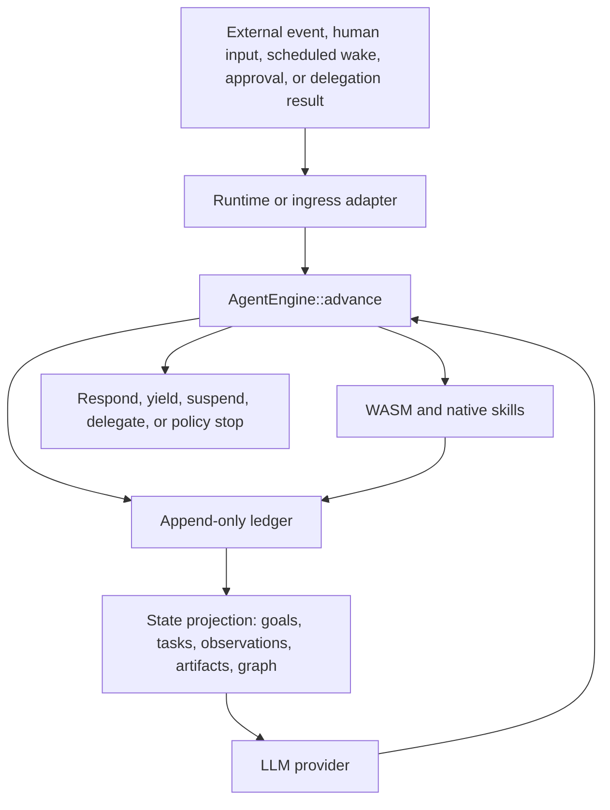

# RainEngine

RainEngine is an event-sourced Rust library for building durable AI agent
systems. The repository stays internally modular, but the intended public
entrypoint is the single `rain-engine` crate.

```toml
[dependencies]
rain-engine = { version = "0.1", features = ["memory", "blob"] }
```

The core idea is simple: an agent is a state machine backed by an append-only
ledger. Every webhook, human message, scheduled wake, approval, delegation
result, model decision, tool call, tool result, and terminal outcome is
recorded as a durable event. Hosts repeatedly call `AgentEngine::advance(...)`
to move the state machine forward one step at a time.

The kernel also reflects on its own ledger. It records what happened,
summarizes tool and provider performance, applies bounded policy overlays for
future advances, and rolls those overlays back if they regress. Self-improvement
is visible, auditable, and never grants new power silently.

## Feature Matrix

Use the root crate and enable only the integrations you need:

| Goal | Feature |
| --- | --- |
| Kernel types and engine | always available |
| Retrieval helpers | `memory` |
| Blob backends | `blob` |
| Planning helpers | `cognition` |
| WASM skill execution | `wasm` |
| HTTP runtime | `runtime` |
| HTTP client | `client` |
| Channel adapters | `channels` |
| Gemini provider | `provider-gemini` |
| OpenAI-compatible provider | `provider-openai` |
| SQLite store | `store-sqlite` |
| Postgres store | `store-pg` |
| Valkey coordination store | `store-valkey` |

Default features stay lightweight and enable `memory` plus `blob`.

## Quickstart

```rust
use rain_engine::kernel::{
    AdvanceRequest, AgentAction, AgentEngine, AgentTrigger, InMemoryMemoryStore,
    MockLlmProvider, ProcessRequest,
};
use std::sync::Arc;

# #[tokio::main]
# async fn main() -> Result<(), Box<dyn std::error::Error>> {
let memory = Arc::new(InMemoryMemoryStore::new());
let provider = Arc::new(MockLlmProvider::scripted(vec![AgentAction::Respond {
    content: "hello from rain-engine".to_string(),
}]));

let engine = AgentEngine::new(provider, memory);
let request = ProcessRequest::new(
    "quickstart-session",
    AgentTrigger::Message {
        user_id: "user-1".to_string(),
        content: "Say hello".to_string(),
        attachments: Vec::new(),
    },
);

let advance = engine.advance(AdvanceRequest::Trigger(request)).await?;
println!("{:?}", advance.outcome);
# Ok(())
# }
```

For macros such as `#[derive(SkillManifest)]`, add `rain-engine-macros`
alongside the root crate in advanced setups.

## Workspace

The repo remains split into focused crates for maintainability:

- `rain-engine-core`: provider-neutral event kernel, policies, traits, and ledger projections
- `rain-engine-memory`: retrieval over session ledgers
- `rain-engine-blob`: blob backends for multimodal attachments
- `rain-engine-cognition`: optional planning and task orchestration
- `rain-engine-wasm`: Wasmtime executor for untrusted skills
- `rain-engine-runtime`: reference Axum runtime library
- `rain-engine-client`: runtime HTTP client
- `rain-engine-provider-gemini`: Gemini provider
- `rain-engine-openai`: OpenAI-compatible provider
- `rain-engine-store-sqlite`, `rain-engine-store-pg`, `rain-engine-store-valkey`: store integrations
- `rain-engine-channels`, `rain-engine-ingress`, `rain-engine-skills`: supporting integration crates
- `rain-engine-macros`: typed manifest proc macros

## Architecture



## Kernel Contract

`AgentEngine::advance(AdvanceRequest)` is the only core execution primitive. It
loads session history, applies one trigger or continuation, persists derived
kernel events, asks the provider at most once, executes at most one planned tool
graph, persists the resulting records, and returns an `AdvanceResult`.

Tool execution is checkpointed. `CallSkills` decisions are materialized as a
`ToolExecutionGraph`; each node records queued, validated, started, and terminal
checkpoints. On continuation after interruption, the kernel replays the ledger
and resumes unfinished nodes instead of repeating completed work. Tool arguments
are validated against each skill manifest before execution, and invalid inputs
become structured tool results.

Deliberation is auditable rather than hidden. Providers may emit `Plan` actions
with concise summaries, candidate actions, and confidence. Those records can be
refined across advance calls, but the ledger remains the source of truth.

Convenience loops belong outside the kernel. The reference runtime exposes
`run_until_terminal(...)`, and ingress workers use the same pattern when
processing stream entries.

## Self-Improvement

RainEngine can run in `AutoWithGuardrails` mode. After terminal outcomes, it
persists reflection records, tool performance summaries, strategy preferences,
and policy tuning records. Safe numeric limits such as `max_steps`,
`provider_timeout_ms`, `max_tool_timeout_ms`, and `max_parallel_skill_calls` can
be adjusted for future advances through `PolicyOverlay` records.

Guardrails are explicit:

- prior ledger records are never rewritten
- scope expansion, native-skill enablement, capability expansion, provider
  changes, and cost-limit increases are not applied automatically
- every automatic overlay includes evidence, prior/projected policy, confidence,
  and rollback condition
- regressions create rollback records and remove the overlay from future
  effective policy

## Library Surface

RainEngine intentionally stops at reusable libraries. There are no first-party
CLI, standalone daemon binary, or browser UI surfaces in this repository. The
runtime, client, ingress, store, and provider crates are intended to be
embedded in other systems that provide their own process model, configuration
UX, and operator tooling.

## State Model

RainEngine treats state as a projection of durable events:

- `GoalRecord` and `TaskRecord` describe planned work.
- `ObservationRecord` captures external facts and human/system input.
- `ArtifactRecord` references generated or uploaded data.
- `ResourceRef` and `RelationshipEdge` form the world graph.
- `PendingApprovalRecord`, `DelegationRecord`, and wake records make suspended
  work resumable without serializing an async stack.

The ledger remains canonical. Retrieval, graph views, caches, and runtime state
must be rebuildable from stored records.

## Examples

- In-memory kernel: [examples/in_memory_kernel.rs](/Users/adrift/projects/rain-engine/examples/in_memory_kernel.rs)
- SQLite-backed embedding: [examples/sqlite_embedding.rs](/Users/adrift/projects/rain-engine/examples/sqlite_embedding.rs)
- Gemini provider setup: [examples/provider_gemini.rs](/Users/adrift/projects/rain-engine/examples/provider_gemini.rs)
- OpenAI-compatible provider setup: [examples/provider_openai.rs](/Users/adrift/projects/rain-engine/examples/provider_openai.rs)

## Verification

```bash
cargo fmt
cargo clippy --workspace --all-targets
cargo test --workspace --all-targets --quiet
cargo package --allow-dirty
```
