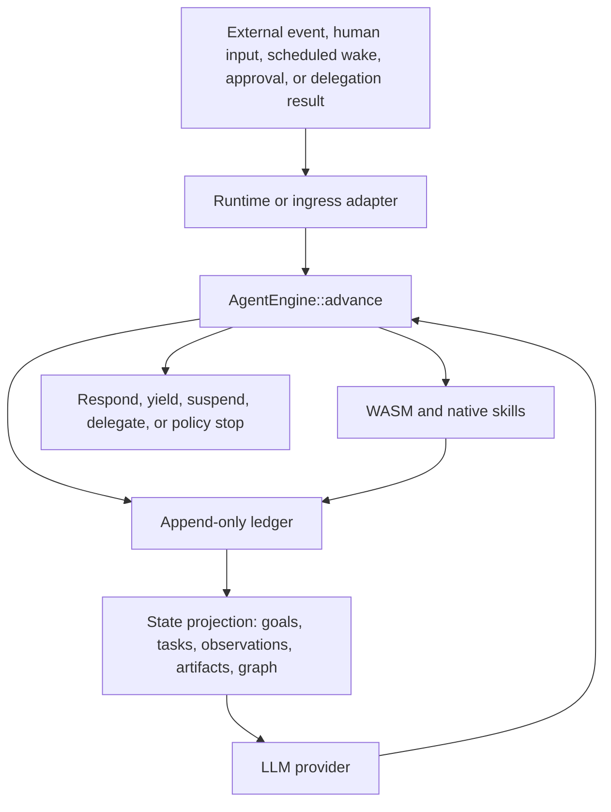

# RainEngine

RainEngine is an event-sourced Rust kernel for building durable AI agent systems.

The core idea is simple: an agent is a state machine backed by an append-only
ledger. Every webhook, human message, scheduled wake, approval, delegation
result, model decision, tool call, tool result, and terminal outcome is recorded
as a durable event. Runtimes repeatedly call `AgentEngine::advance(...)` to move
the state machine forward one step at a time.

## Workspace

- `rain-engine-core`: provider-neutral event kernel, domain models, policies, traits, ledger projections, and in-memory stores
- `rain-engine-cognition`: optional planners, task routing, review policy, wake policy, and reflection policy
- `rain-engine-memory`: ledger-backed exact replay, recent working sets, graph lookup, and simple semantic retrieval
- `rain-engine-runtime`: reference Axum runtime that parses events and owns the advance loop
- `rain-engine-ingress`: shared event envelope and Valkey Streams worker utilities
- `rain-engine-blob`: local and in-memory blob stores for multimodal attachments
- `rain-engine-wasm`: Wasmtime executor for untrusted skills with explicit host capabilities
- `rain-engine-macros`: `#[derive(SkillManifest)]` for typed skill manifests
- `rain-engine-provider-gemini`: Gemini REST provider with multimodal content, parallel tool calls, and cache metadata
- `rain-engine-openai`: OpenAI-compatible baseline provider
- `rain-engine-store-pg`: Postgres append-only ledger store
- `rain-engine-store-sqlite`: SQLite ledger store for local development and tests
- `rain-engine-store-valkey`: Valkey coordination claims and short-lived scratchpad storage
- `rain-engine-cli`: declarative `agent.yaml` validation and runtime bootstrapping

## Architecture



## Kernel Contract

`AgentEngine::advance(AdvanceRequest)` is the only core execution primitive. It
loads session history, applies one trigger or continuation, persists derived
kernel events, asks the provider at most once, executes at most one planned tool
batch, persists the resulting records, and returns an `AdvanceResult`.

Convenience loops belong outside the kernel. The reference runtime exposes
`run_until_terminal(...)`, and ingress workers use the same pattern when
processing stream entries.

## State Model

RainEngine treats state as a projection of durable events:

- `GoalRecord` and `TaskRecord` describe planned work.
- `ObservationRecord` captures external facts and human/system input.
- `ArtifactRecord` references generated or uploaded data.
- `ResourceRef` and `RelationshipEdge` form the world graph.
- `PendingApprovalRecord`, `DelegationRecord`, and wake records make suspended
  work resumable without serializing an async stack.

The ledger remains canonical. Retrieval, graph views, caches, and runtime state
must be rebuildable from stored records.

## Examples

- Embedded SQLite flow: [embedded_sqlite.rs](/Users/adrift/projects/rain-engine/rain-engine-runtime/examples/embedded_sqlite.rs)
- Runtime bootstrap config: [runtime_postgres.rs](/Users/adrift/projects/rain-engine/rain-engine-runtime/examples/runtime_postgres.rs)
- Customer support deployment sketch: [customer_support_agent.rs](/Users/adrift/projects/rain-engine/rain-engine-cli/examples/customer_support_agent.rs)
- Declarative deployment config: [agent.yaml](/Users/adrift/projects/rain-engine/rain-engine-cli/examples/agent.yaml)

## Verification

```bash
cargo fmt
cargo test --workspace --all-targets --quiet
```
